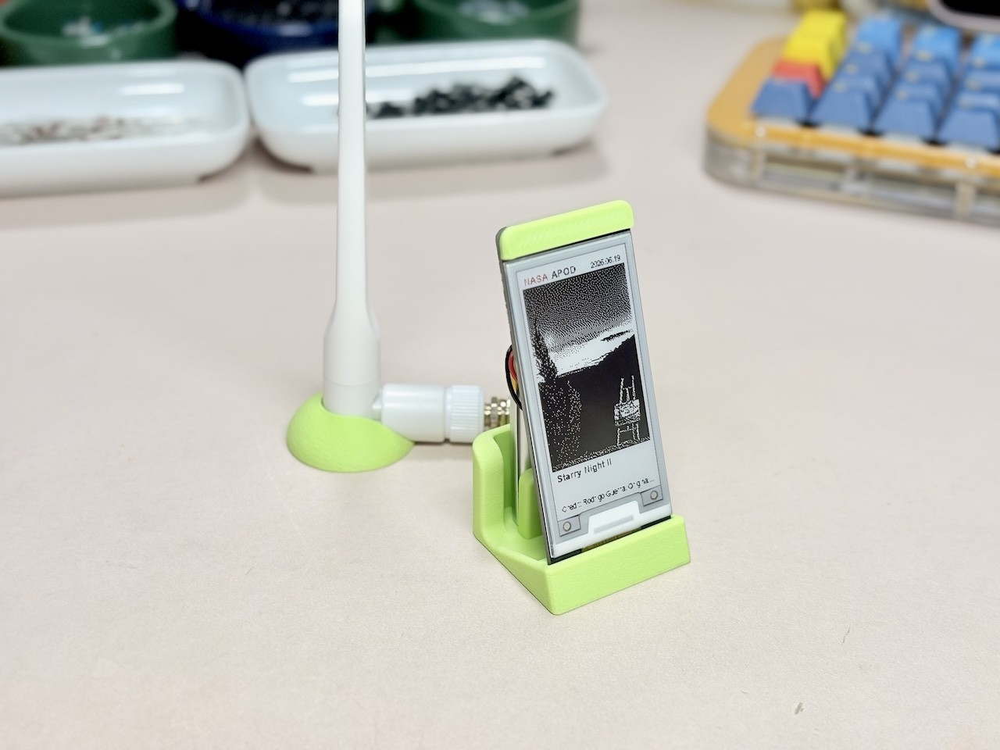

# E-ink APOD Display （[日本語](README_JP.md)）



A local e-paper display system that fetches NASA Astronomy Picture of the Day (APOD) on a Mac and shows it on a XIAO ESP32C3 with a 2.13-inch three-color e-paper display.
MakerWorld: [E-ink Display Stand](https://makerworld.com/ja/models/2952512).

## Structure

- `image-render/`: Mac side. Fetches NASA APOD, renders an e-paper image, and serves it over HTTP.
- `xiao-esp32c3-display/`: XIAO ESP32C3 side. Fetches `/apod_image.bin` from the Mac, draws it on the e-paper display, then enters deep sleep for 12 hours.

## Setup Overview

### Mac Side

```bash
cd image-render
python3 -m pip install -r requirements.txt
cp config.example.json config.json
python3 fetch_apod.py
python3 apod_api.py --host 0.0.0.0 --port 8765
```

Endpoints:

- `http://localhost:8765/apod.txt`
- `http://localhost:8765/apod.json`
- `http://localhost:8765/apod_image.png`
- `http://localhost:8765/apod_image.bin`

### XIAO ESP32C3 Side

```bash
cd xiao-esp32c3-display
```

Edit `secrets.h` with your Wi-Fi SSID, password, and the host name or IP address of the Mac running `apod_api.py`, then upload `xiao-esp32c3-display.ino` with the Arduino IDE.

## Ignored Files

- `image-render/config.json`
- `image-render/apod_state.json`
- `image-render/cache/`
- `plasticity-private/`

## 3D Models

Public 3D model files are in `step/`. Use STEP files for editing and dimensional checks, and the 3MF file for slicer import.

Plasticity working files live in `plasticity-private/` and are not included in the public repository.

## License

- Code and documentation: MIT License. See `LICENSE`.
- 3D models under `step/`: CC0 1.0 Universal. See `step/LICENSE`.
